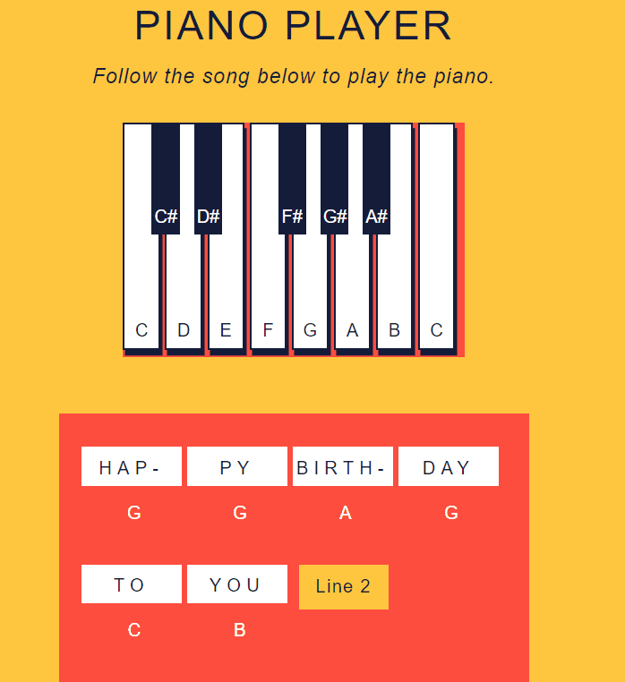

# piano-keys
Create a piano player with DOM events in JavaScript
<h2>Properites</h2>
<ul>
  <li>Piano key background change color onmousedown (key pressed) or onmouseup (key released)</li>
  <li>getElementById to grab elment and change display properties or innerHTML</li>
  <li>eventAssignment function with event handler properties</li>
  <li>Loop that runs array elements through the eventAssignment function</li>
  <li>Use of event.target</li>
</ul>
<h2>Demo</h2>

